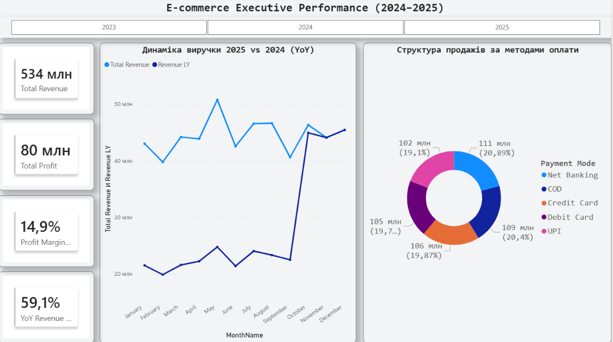
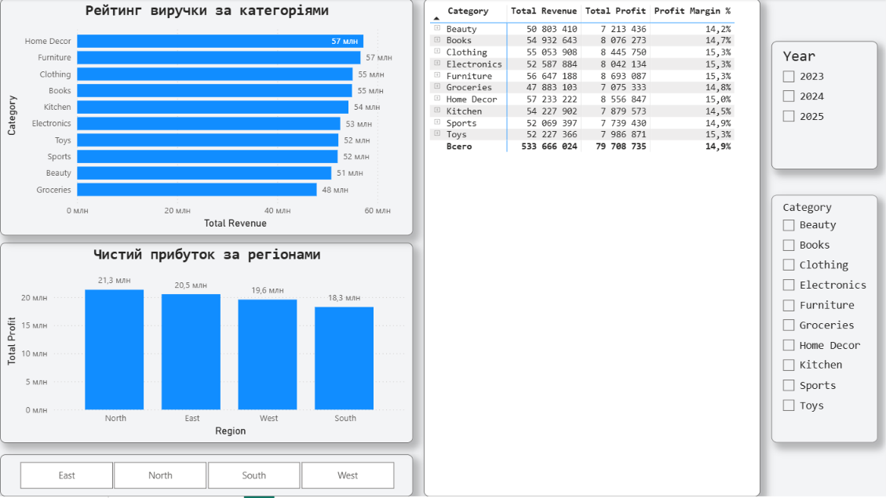

# 📊 E-commerce Sales & Margin Performance Analytics (Power BI & Tableau)

> **Educational Pet Project** | Multi-tool BI implementation (Power BI Desktop & Tableau Public) utilizing an open-source retail transactions dataset from Kaggle.

---

## 🔗 Project Links & Artifacts
* **Tableau Public Interactive Viz:** [View on Tableau Public](https://public.tableau.com/app/profile/kateryna.shatunova/viz/Ecommerce_Analytics_TProject/ExecutiveOverview#1)
* **Power BI File (.pbix):** [`Ecommerce_Analytics_PProject.pbix`](Ecommerce_Analytics_PProject.pbix)
* **Dataset Source:** Open Kaggle dataset — [`Ecommerce_Sales_Data_2024_2025.csv`](Ecommerce_Sales_Data_2024_2025.csv)

---

## 🎯 Project Overview & Objectives
The purpose of this educational project was to build an end-to-end analytical pipeline across two major BI platforms (**Power BI** and **Tableau**) using the same transactional data:
1. **Model & Clean Data:** Process raw transaction logs and implement Star Schema modeling.
2. **DAX & Calculated Fields:** Build robust dynamic measures for YoY analysis and profitability.
3. **Executive UX Design:** Assemble structured two-page dashboards adhering to commercial container design (Card UI) and balanced color hierarchy.
4. **Compare Platform Capabilities:** Replicate the same business logic, hierarchies, and drill-downs in both environments.

---

## 🛠 Tech Stack
* **BI & Visualization:** Microsoft Power BI Desktop, Tableau Desktop / Public.
* **Languages & Analytics:** DAX (Data Analysis Expressions), Tableau Calculated Fields, Power Query (M).
* **Data Modeling:** Star Schema (`1:*` relationships, continuous Date Dimension).
* **Data Source:** Kaggle E-commerce Retail Transactions (5,000 records, 2023–2025).

---

## 📸 Dashboard Preview

### Page 1: Executive Overview & YoY Trends
* High-level financial KPIs (Total Revenue, Total Profit, Margin %, YoY Growth %).
* Monthly revenue dynamic: 2024 vs 2025 comparison (`SAMEPERIODLASTYEAR`).
* Payment gateway distribution (COD, Cards, UPI, Net Banking).

### Page 2: Product & Regional Deep Dive
* Revenue ranking across 10 retail categories.
* Regional profitability breakdown (North, East, West, South).
* Drill-down hierarchy matrix (`Category` ➔ `Sub-Category`) with conditional formatting.

---

## 💡 Key Analytical Findings
* **Consistent Unit Economics:** Despite volume fluctuations, gross margin remained exceptionally stable at **~14.9% – 15.0%** across 2023–2025, demonstrating healthy pricing control without margin erosion.
* **Time Intelligence & Incomplete Reporting:** The 2025 revenue dip (-27.0% YoY) reflects an incomplete reporting period (data ends October 3, 2025) rather than operational failure; monthly run-rates remained on par with peak 2024.
* **Product Profit Drivers:** Identified high-margin drivers such as *Mixer Grinders* (**17.1%**) and *Shoes* (**16.5%**), while highlighting lower-performing items like *Face Creams* (**13.7%**).
* **Diversified Channels:** Payment methods were evenly distributed (~19% to ~21%), mitigating single-gateway dependency risks.

---

## 📐 Data Model Architecture (Star Schema)
* **Fact Table (`Fact_Sales`):** 5,000 rows containing orders, prices, discounts, unit margins, and payment details.
* **Dimension Table (`Dim_Date`):** Continuous DAX-generated calendar table (2023–2025) ensuring accurate Time Intelligence calculations.
* **Relationship:** Unidirectional `1:*` relationship from `Dim_Date[Date]` to `Fact_Sales[Order Date]`.
# 📊 Аналітика продажів та рентабельності E-commerce (Power BI та Tableau)

> **Навчальний пет-проєкт** | Реалізація аналітичного рішення на двох платформах (Power BI Desktop та Tableau Public) на основі відкритого датасету роздрібних транзакцій із Kaggle.

---

## 🔗 Матеріали проєкту
* **Таблиця та дашборд у Tableau Public:** [Переглянути онлайн на Tableau Public](https://public.tableau.com/app/profile/kateryna.shatunova/viz/Ecommerce_Analytics_TProject/ExecutiveOverview#1)
* **Звіт Power BI (.pbix):** [`Ecommerce_Analytics_PProject.pbix`](Ecommerce_Analytics_PProject.pbix)
* **Джерело даних:** Відкритий датасет із платформи Kaggle — [`Ecommerce_Sales_Data_2024_2025.csv`](Ecommerce_Sales_Data_2024_2025.csv)

---

## 🎯 Мета та опис навчального проєкту
Метою цього навчального проєкту є наскрізне моделювання та візуалізація одного й того самого датасету у двох провідних BI-середовищах (**Power BI** та **Tableau**) для порівняння їхньої архітектури:
1. **Очищення та структурування:** Обробка відкритих даних із Kaggle та побудова реляційної моделі (схема «Зірка»).
2. **Розрахунок бізнес-показників:** Реалізація розрахунків рентабельності та порівняння рік-до-року (YoY) через DAX та Calculated Fields.
3. **UX/UI дашбордів:** Верстка двосторінкового звіту за комерційними стандартами контейнерного дизайну (Card UI) та мінімалістичної колірної гами.
4. **Крос-платформенне порівняння:** Відтворення однакової бізнес-логіки та інтерактивних фільтрів у Power BI та Tableau.

---

## 🛠 Стек технологій
* **BI-інструменти:** Microsoft Power BI Desktop, Tableau Desktop / Public.
* **Мови та розрахунки:** DAX (Data Analysis Expressions), обчислювані поля Tableau, Power Query (M).
* **Моделювання даних:** Схема «Зірка» (зв'язки `1:*`, неперервний календар `Dim_Date`).
* **Джерело даних:** Kaggle E-commerce Retail Transactions (5 000 рядків транзакцій, 2023–2025 рр.).

---

## 📸 Структура звіту

### Сторінка 1: Executive Overview & YoY Trends
* Головні комерційні KPI (виручка, прибуток, рентабельність %, приріст YoY).
* Щомісячна динаміка виручки 2024 проти 2025 року (`SAMEPERIODLASTYEAR`).
* Структура платіжних каналів (COD, карти, UPI, інтернет-банкінг).

### Сторінка 2: Product & Regional Deep Dive
* Рейтинг виручки за 10 продуктовими категоріями.
* Прибутковість регіонів (North, East, West, South).
* Деревоподібна матриця деталізації (`Category` ➔ `Sub-Category`) з умовним форматуванням.

---

## 💡 Отримані бізнес-інсайти
* **Стабільність юніт-економіки:** Маржинальність мережі залишається контрольованою на рівні **14,9% – 15,0%** протягом усього періоду 2023–2025 рр., що свідчить про виважену дисконтну політику без демпінгу.
* **Фактор неповної звітності:** Зниження загального показника виручки 2025 року (-27,0% YoY) пояснюється завершенням спостережень 3 жовтня 2025 року, тоді як щомісячний темп генерації продажів тримався на рівні пікового 2024 року.
* **Продуктові драйвери прибутку:** Виявлено ключові високоефективні підкатегорії товарів (наприклад, *Mixer Grinders* із маржею **17,1%**), а також сегменти з нижчими показниками (*Face Creams* — **13,7%**).
* **Низька канальна залежність:** Рівномірний розподіл оплат між 5 способами розрахунків (~20% кожен) усуває операційні ризики збоїв конкретного шлюзу.

---

## 📐 Модель даних (Схема «Зірка»)
* **Таблиця фактів (`Fact_Sales`):** 5 000 замовлень із показниками цін, кількості, собівартості, знижок та платежів.
* **Таблиця вимірів (`Dim_Date`):** Календарний довідник (2023–2025 рр.), згенерований за допомогою DAX із налаштованим сортуванням місяців.
* **Зв'язок:** Однонаправлений зв'язок `1:*` між `Dim_Date[Date]` та `Fact_Sales[Order Date]`.

